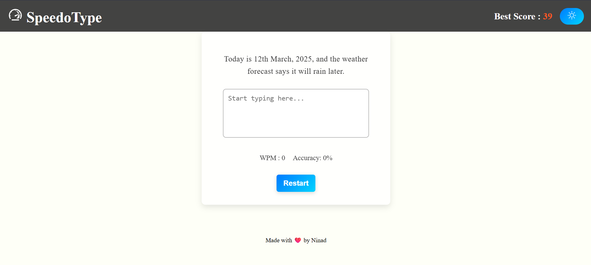

# SpeedoType


Live Demo: https://speedotypebyn1n4d.web.app/

SpeedoType is a one-page typing speed test built with React and Vite. It measures WPM, tracks accuracy in real time, saves the best score locally, and supports light and dark mode.

## Features

- Random typing prompts
- Live WPM and accuracy tracking
- Best score saved in local storage
- Light/dark theme toggle
- Restart button
- Copy and paste prevention

## Tech Stack

- React
- Vite
- JavaScript
- CSS
- React Icons
- LocalStorage
- Firebase Hosting

## Project Structure

```text
-- src/
   |-- App.css
   |-- App.jsx
   |-- assets/
   |   |-- hero.png
   |   |-- react.svg
   |   |-- speedotype-home.png
   |   `-- vite.svg
   |-- components/
   |   |-- Navbar.css
   |   `-- Navbar.jsx
   |-- index.css
   |-- main.jsx
   `-- pages/
       |-- Home.css
       `-- Home.jsx

```

## Setup

```bash
git clone https://github.com/N1n4d0413/speedOtype1312
cd speedoType
npm install
npm run dev
```

## Build

```bash
npm run build
npm run preview
```

## Screenshot



## Demo

- Live Demo: https://speedotypebyn1n4d.web.app/

## License

MIT

## Author

Ninad Kathe
